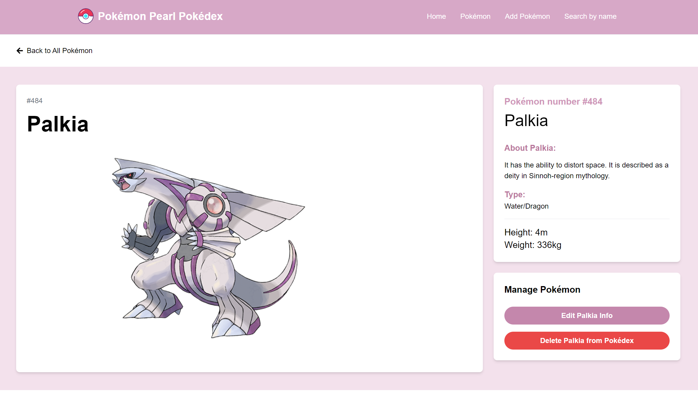
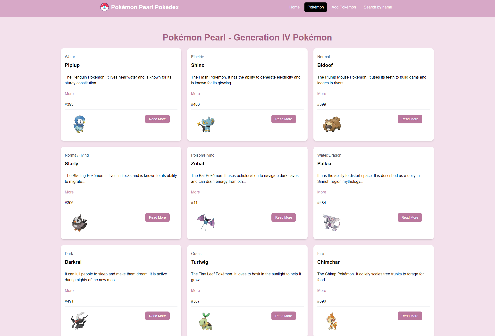
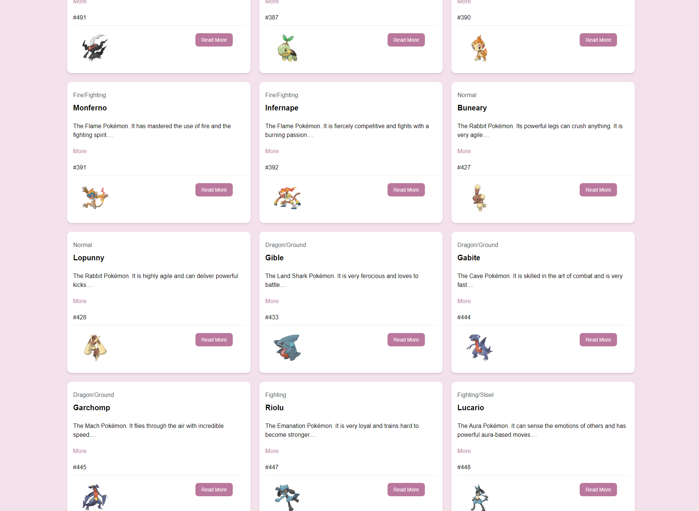
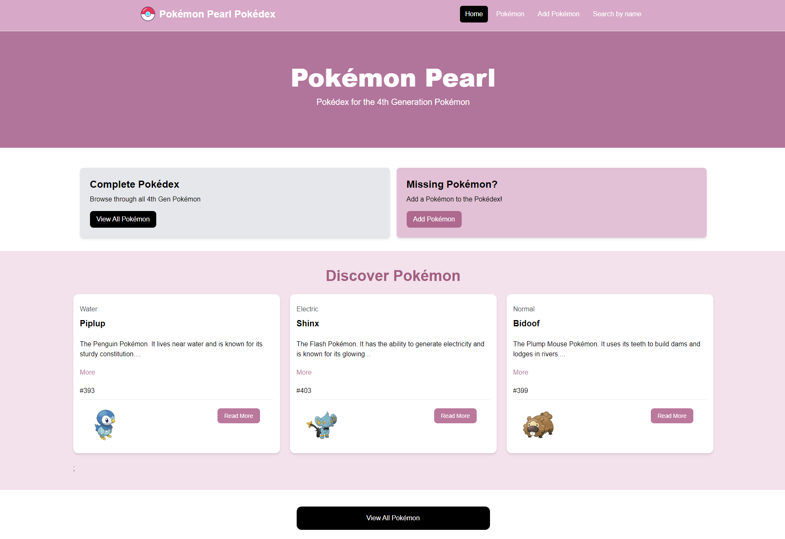
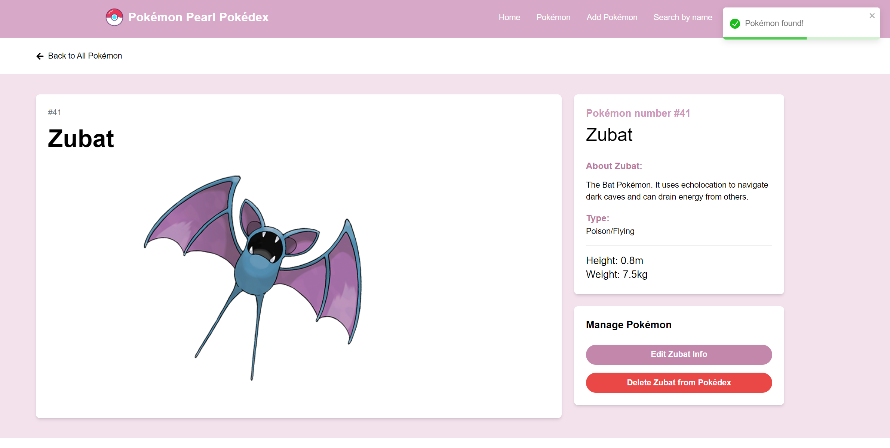

# Pokémon Pearl Pokédex 

## Project Description

Pokémon Pearl Pokédex is a React-based single-page application that serves as a user-friendly interface for browsing Pokémon data. 
This project was designed to provide a way to search for, view, add, and delete Pokémon information. 
The application interacts with a robust ASP.NET backend.

## Motivation

The motivation behind this project was to create a dynamic, interactive tool to access, 
manage, and manipulate Pokémon data. As a student, I wanted to develop a practical application that demonstrated my understanding of React, 
CRUD functionality and backend integration.
Furthermore, as a longtime fan of Pokémon Pearl, 
this project brought me the added joy of revisiting the game I loved as a kid.

## Why This Project

Building this project allowed me to apply my knowledge of React, ASP.NET, and Tailwind CSS in a real-world scenario. 
It provided an opportunity to tackle challenges related to frontend development, API integration, and data management, 
thereby enhancing my skills and preparing me for future development tasks.

## Problem Solved

This application addresses the need for an intuitive and visually appealing way to search for, add, view, and delete Pokémon. 
Pokémon information such as type, height, weight, and images, can be found quickly, all in one place. 
The CRUD functionality allows management of the Pokémon data directly from the interface, making it easier to keep the database up-to-date.

## Features

- **Search by Name**: Finds Pokémon using the search bar integrated into the navigation bar.  
  

- **Detailed Pokémon Information**: View of details for a specific Pokémon including type, a descriptive text, an image and some other details for each Pokémon.  
  

- **CRUD Operations**: 
  - **View**: Browse and view existing Pokémon data.  
      
    
  - **Post**: Add new Pokémon to the database with detailed information.  
    
  - **Delete**: Remove Pokémon from the database as needed.

- **Homepage**: 
  

- **Image Display**: Each Pokémon’s image is fetched and displayed directly from the PokeAPI.

- **Search Result and Notifications**: When a Pokémon is successfully found,
- the app displays a success toast and loads the Pokémon's details page.
- If the Pokémon can't be found, an error toast is displayed.
  

## What I Learned

- **React Development**: Gained hands-on experience with React for building interactive UIs and managing state.
- **API Integration**: Worked with the PokeAPI and ASP.NET backend to fetch, add, and delete data.
- **CRUD Operations**: Implemented full CRUD functionality to manage Pokémon data effectively.
- **Frontend Styling**: Utilized Tailwind CSS for creating responsive and modern user interfaces.
- **Debugging and Problem-Solving**: Overcame challenges related to API errors, method restrictions, and CRUD operations.

## Technologies Used

- **React**: JavaScript library for building user interfaces.
- **Vite**: Build tool for a fast development experience.
- **Tailwind CSS**: Utility-first CSS framework for styling.
- **ASP.NET**: Backend framework for managing data and API endpoints.
- **PokeAPI**: Public API for accessing Pokémon data.
- **React Router DOM**: Library for managing navigation and routing within the React application.

## Challenges and Future Enhancements

While developing this project, some challenges included handling CORS issues, 
dealing with method restrictions in the backend, and implementing CRUD functionality effectively. 
Future enhancements could involve expanding the Pokémon dataset, or implementing additional filtering options.